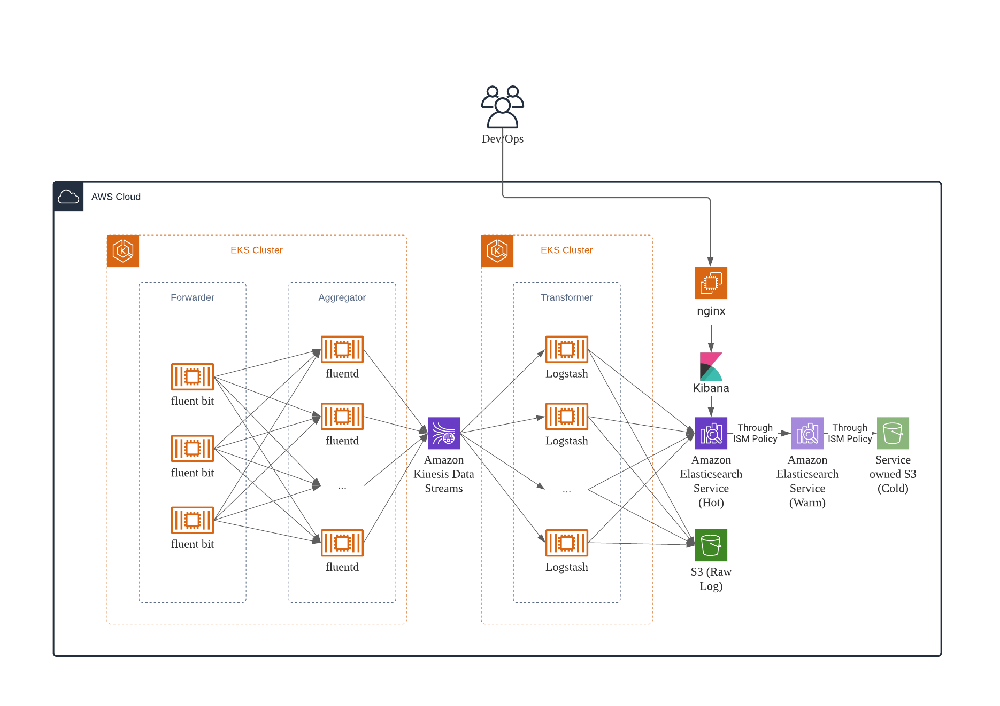
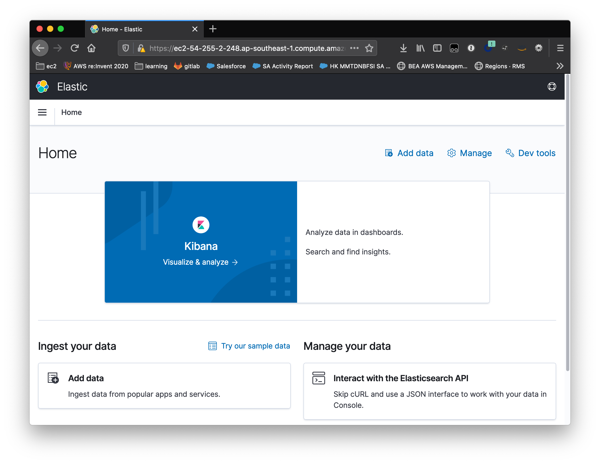
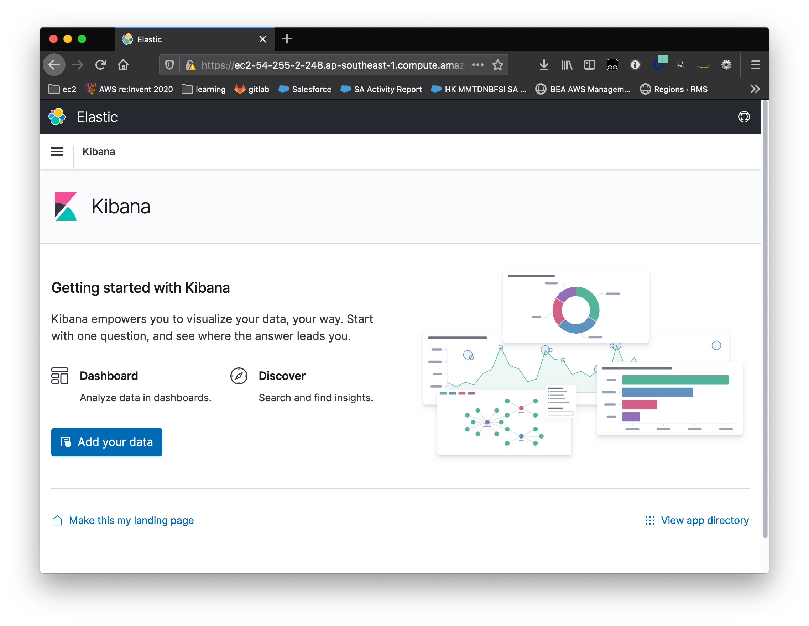
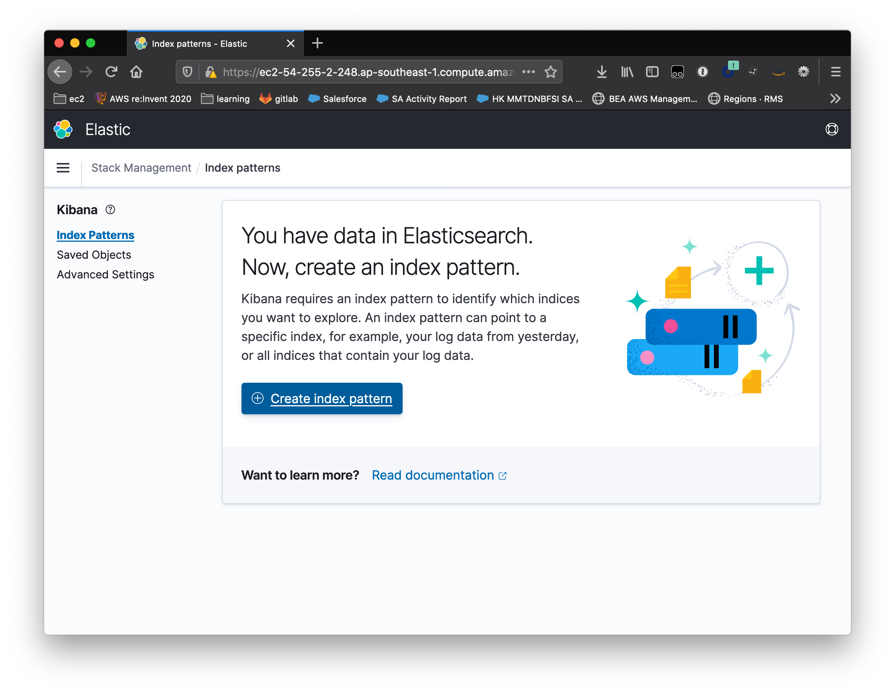
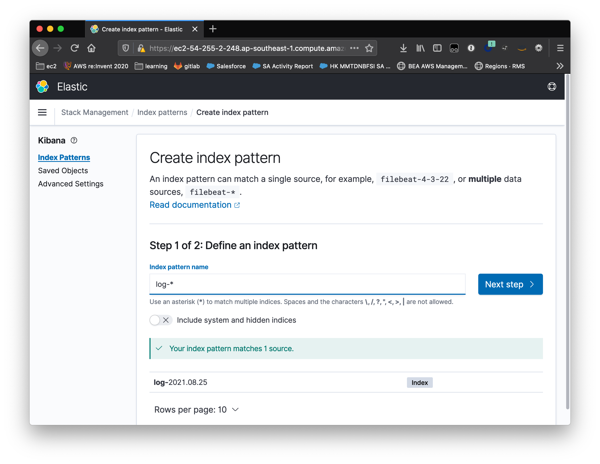
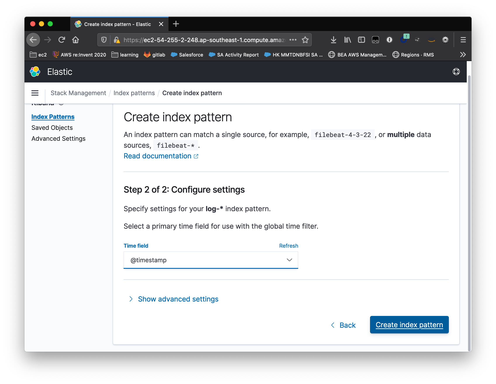

# Amazon Elasticsearch Logging Architecture

## Architecture Diagram


## Prerequisites
* terraform 1.0+
* awscli 2.2+
* golang 1.15+
* docker
* helm 3+

## Build kinesis autoscaling function
Fetch `kinesis-auto-scaling` submodule and build
```shell
git submodule update --init --recursive
cd modules/kinesis-auto-scaling
GOOS=linux go build -o ../main scale.go
```

## Provision VPC, EKS, Kinesis, AES using Terraform
* Customize configuration parameters like Elasticsearch master nodes enable flag (`es_dedicated_master_enabled`), Instance Type (`es_dedicated_master_type`) / number of nodes (`es_dedicated_master_count`), data nodes Instance Type (`es_instance_type`) / number of nodes (`es_instance_count`)
```shell
cp terraform.example.tfvars terraform.tfvars
```

```shell
terraform init
terraform plan
terraform apply
```

Update `kubeconfig`
```shell
aws eks update-kubeconfig --name $(terraform output -raw eks_cluster_id)
```

Enable ES cold storage through awscli
```shell
aws es update-elasticsearch-domain-config --domain-name $(terraform output -raw es_domain_name) --elasticsearch-cluster-config ColdStorageOptions={Enabled=True}
```

## Aggregation Layer - Logstash
### Install Logstash Helm Chart
```sh
helm repo add elastic https://helm.elastic.co
helm upgrade --install \
  --set image="$(terraform output -raw logstash_repo_url)" \
  --set imageTag="$(terraform output -raw logstash_image_tag)" \
  --set rbac.create=true \
  --set rbac.serviceAccountAnnotations."eks\.amazonaws\.com/role-arn"="$(terraform output -raw logstash_iam_role_arn)" \
  --set extraEnvs\[0\].name="AWS_REGION",extraEnvs\[0\].value="$(terraform output -raw region)" \
  --set extraEnvs\[1\].name="KINESIS_STREAM_NAME",extraEnvs\[1\].value="$(terraform output -raw kinesis_stream_name)" \
  --set extraEnvs\[2\].name="ES_ENDPOINT",extraEnvs\[2\].value="$(terraform output -raw es_domain_endpoint)" \
  -f modules/apps/logstash/logstash-override-values.yaml \
  logstash --namespace $(terraform output -raw eks_logstash_namespace) elastic/logstash
```

## Elasticsearch Index Management
## ES `Index pattern` and `Index State Management` configuration in Kibana
Open browser, visit https://`nginx_endpoint`

* Add data
  
* Create index pattern, `log-*`
    
    
  
* Create index state policy template
Click `Index Management` on right navigation bar, click `Create Policy`
* policy id: log_state_management_policy
* policy content
```json
{
  "policy": {
    "description": "Hot-Warm-Cold-Delete workflow.",
    "default_state": "hot",
    "schema_version": 1,
    "states": [{
      "name": "hot",
      "actions": [],
      "transitions": [{
        "state_name": "warm",
        "conditions": {
          "min_index_age": "1d"
        }
      }]
    },
      {
        "name": "warm",
        "actions": [{
          "warm_migration": {},
          "retry": {
            "count": 5,
            "delay": "1h"
          }
        }],
        "transitions": [{
          "state_name": "cold",
          "conditions": {
            "min_index_age": "2d"
          }
        }]
      },
      {
        "name": "cold",
        "actions": [{
          "cold_migration": {
            "timestamp_field": "@timestamp"
          }
        }
        ],
        "transitions": [{
          "state_name": "delete",
          "conditions": {
            "min_index_age": "7d"
          }
        }]
      },
      {
        "name": "delete",
        "actions": [
          {
            "cold_delete": {}
          }]
      }
    ],
    "ism_template": {
      "index_patterns": ["log-*"],
      "priority": 100
    }
  }
}
```

## Work in progress
* `fluent-bit` configuration tuning, like enabling aggregation, `flush` interval
* `fluentd` necessary? any information enrichment required to implement in fluentd?
* `kinesis` scaling threshold determination and actual scale in/out testing
* (optional) `aws-node-termination-handler` for handling spot instance interruption, only applicable if Spot Instance is used
* `logstash` S3 output sink, S3 bucket lifecycle policy
* `logstash` scaling with log processing, (possible solution: HPA+CA)
* `prometheus` service monitor and `grafana` dashboard to visualize throughput on `fluent-bit`, `fluentd` and `logstash`
* security hardening, e.g. kinesis vpc endpoint, elasticsearch access policy

# References
## Amazon EKS fluentd scaling
[Fluentd considerations and actions required at scale in Amazon EKS](https://aws.amazon.com/blogs/containers/fluentd-considerations-and-actions-required-at-scale-in-amazon-eks/)  
[How to set Fluentd and Fluent Bit input parameters in FireLens](https://aws.amazon.com/blogs/containers/how-to-set-fluentd-and-fluent-bit-input-parameters-in-firelens/)  
[Centralized Container Logging with Fluent Bit](https://aws.amazon.com/blogs/opensource/centralized-container-logging-fluent-bit/)  
[Choosing container logging options to avoid backpressure](https://aws.amazon.com/blogs/containers/choosing-container-logging-options-to-avoid-backpressure/)  
[Access Logging Made Easy with AWS App Mesh and Fluent Bit](https://aws.amazon.com/blogs/containers/access-logging-made-easy-with-aws-app-mesh-and-fluent-bit/)  
[Kubernetes Logging powered by AWS for Fluent Bit](https://aws.amazon.com/blogs/containers/kubernetes-logging-powered-by-aws-for-fluent-bit/)  

## Kinesis Data Stream
[Scale Your Amazon Kinesis Stream Capacity with UpdateShardCount](https://aws.amazon.com/blogs/big-data/scale-your-amazon-kinesis-stream-capacity-with-updateshardcount/)  
[Scale Amazon Kinesis Data Streams with AWS Application Auto Scaling](https://aws.amazon.com/blogs/big-data/scaling-amazon-kinesis-data-streams-with-aws-application-auto-scaling/)  
[Auto scaling Amazon Kinesis Data Streams using Amazon CloudWatch and AWS Lambda](https://aws.amazon.com/blogs/big-data/auto-scaling-amazon-kinesis-data-streams-using-amazon-cloudwatch-and-aws-lambda/)  
[Kinesis Data Streams Auto Scaling](https://github.com/aws-samples/kinesis-auto-scaling)  
[Implementing Efficient and Reliable Producers with the Amazon Kinesis Producer Library](https://aws.amazon.com/blogs/big-data/implementing-efficient-and-reliable-producers-with-the-amazon-kinesis-producer-library/)  

## Kinesis Data Analytics
[AWS Blog - Streaming ETL with Apache Flink and Amazon Kinesis Data Analytics](https://aws.amazon.com/blogs/big-data/streaming-etl-with-apache-flink-and-amazon-kinesis-data-analytics/)  
[Flink Application](https://github.com/aws-samples/amazon-kinesis-analytics-streaming-etl)  

## Logstash
[Logstash - Using Environment Variables in the Configuration](https://www.elastic.co/guide/en/logstash/current/environment-variables.html)  

## Observability
[AWS Distro for OpenTelemetry](https://aws-otel.github.io/docs/introduction)  

## Amazon Elasticsearch
[Managing Indices Ultrawarm](https://docs.aws.amazon.com/elasticsearch-service/latest/developerguide/ultrawarm.html)

## General Logging
[Measuring the performance of a logging subsystem in Kubernetes](https://banzaicloud.com/blog/logging-operator-monitoring/)

## Credits
Special credit given to this repo for providing an automatic scaling solution to Kinesis Data Stream - https://github.com/aws-samples/kinesis-auto-scaling